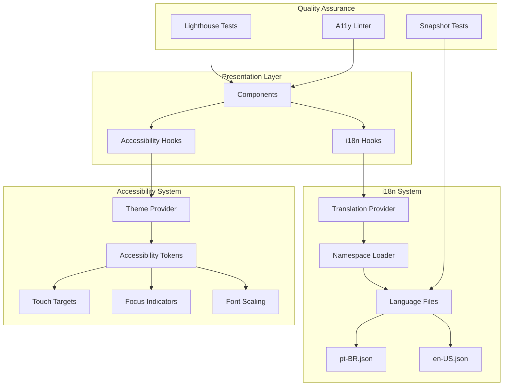

# Design Document

## Overview

This design document outlines the comprehensive approach to enhancing accessibility (a11y) and internationalization (i18n) across the FODMAP Fácil mobile application. The design focuses on three core pillars:

1. **Accessibility Compliance**: Ensuring all components meet WCAG 2.1 AA standards with proper ARIA roles, focus management, and dynamic font scaling
2. **Internationalization Architecture**: Organizing translation strings into logical namespaces with complete coverage for Portuguese (pt-BR) and English (en-US)
3. **Empathetic Microcopy**: Crafting user-friendly, compassionate messaging for errors, empty states, confirmations, and actions

The design leverages the existing i18n infrastructure (i18next with react-i18next) and theme system while introducing systematic improvements to component accessibility patterns and translation organization.

## Architecture

### High-Level Architecture



````

### Component Accessibility Pattern

All components will follow a standardized accessibility pattern:

```typescript
interface AccessibleComponentProps {
  // Required accessibility props
  accessibilityLabel: string;
  accessibilityRole: AccessibilityRole;

  // Optional but recommended
  accessibilityHint?: string;
  accessibilityState?: AccessibilityState;
  accessibilityValue?: AccessibilityValue;

  // Focus management
  accessible?: boolean;
  importantForAccessibility?: 'auto' | 'yes' | 'no' | 'no-hide-descendants';

  // Testing
  testID?: string;
}
````

### i18n Namespace Organization

Translation files will be organized into feature-based namespaces:

```
locales/
├── pt-BR/
│   ├── common.json          # Shared strings (buttons, actions, states)
│   ├── auth.json            # Authentication screens
│   ├── onboarding.json      # Onboarding flow
│   ├── journey.json         # Journey/dashboard screens
│   ├── diary.json           # Symptom diary
│   ├── testWizard.json      # Test wizard flow
│   ├── reports.json         # Reports and analytics
│   ├── notifications.json   # Notification content
│   ├── settings.json        # Settings screens
│   ├── errors.json          # Error messages
│   └── validation.json      # Form validation messages
└── en-US/
    └── [same structure]
```

## Components and Interfaces

### 1. Accessibility Audit Utility

A utility to audit components for accessibility compliance:

```typescript
interface AccessibilityAuditResult {
  componentName: string;
  issues: AccessibilityIssue[];
  score: number;
  passed: boolean;
}

interface AccessibilityIssue {
  severity: 'critical' | 'warning' | 'info';
  rule: string;
  message: string;
  element?: string;
  suggestion: string;
}

class AccessibilityAuditor {
  auditComponent(component: React.ComponentType): AccessibilityAuditResult;
  auditTree(rootComponent: React.ComponentType): AccessibilityAuditResult[];
  generateReport(): AccessibilityReport;
}
```

### 2. Enhanced i18n Hook

An enhanced hook that provides additional functionality:

```typescript
interface UseTranslationEnhanced {
  t: TFunction;
  i18n: i18n;
  ready: boolean;

  // Additional helpers
  tWithFallback: (key: string, fallback: string, options?: object) => string;
  tPlural: (key: string, count: number, options?: object) => string;
  tDate: (date: Date, format?: string) => string;
  tNumber: (value: number, options?: Intl.NumberFormatOptions) => string;

  // Namespace helpers
  namespace: (ns: string) => TFunction;
}

function useTranslationEnhanced(namespace?: string): UseTranslationEnhanced;
```

### 3. Accessible Component Wrapper

A higher-order component that ensures accessibility compliance:

```typescript
interface AccessibleWrapperProps {
  children: React.ReactNode;
  label: string;
  role: AccessibilityRole;
  hint?: string;
  state?: AccessibilityState;
  onFocus?: () => void;
  onBlur?: () => void;
}

function withAccessibility<P>(
  Component: React.ComponentType<P>,
  defaultProps: Partial<AccessibleWrapperProps>
): React.ComponentType<P & AccessibleWrapperProps>;
```

### 4. Focus Management System

A system to manage focus order and trap focus in modals:

```typescript
interface FocusManager {
  // Focus order management
  registerFocusable(id: string, order: number, ref: React.RefObject): void;
  unregisterFocusable(id: string): void;
  focusNext(): void;
  focusPrevious(): void;
  focusFirst(): void;
  focusLast(): void;

  // Focus trap for modals
  trapFocus(containerRef: React.RefObject): () => void;
  releaseFocus(): void;
}

const useFocusManager = (): FocusManager;
```

### 5. Dynamic Font Scaling System

A system to handle dynamic font scaling:

```typescript
interface FontScalingConfig {
  allowScaling: boolean;
  maxMultiplier: number;
  minMultiplier: number;
  scaleWithAccessibility: boolean;
}

interface ScaledTextProps extends TextProps {
  scalingConfig?: Partial<FontScalingConfig>;
  semanticLevel?: 'heading' | 'body' | 'caption' | 'label';
}

const ScaledText: React.FC<ScaledTextProps>;
const useScaledFontSize: (baseFontSize: number) => number;
```

## Data Models

### Translation Namespace Structure

```typescript
interface TranslationNamespace {
  namespace: string;
  keys: Record<string, string | TranslationObject>;
  metadata: {
    lastUpdated: Date;
    version: string;
    completeness: number; // 0-100%
  };
}

interface TranslationObject {
  value: string;
  context?: string;
  plurals?: Record<string, string>;
  variables?: string[];
}

interface TranslationCoverage {
  namespace: string;
  totalKeys: number;
  translatedKeys: number;
  missingKeys: string[];
  completeness: number;
}
```

### Accessibility Metadata

```typescript
interface ComponentAccessibilityMetadata {
  componentName: string;
  hasAccessibilityLabel: boolean;
  hasAccessibilityRole: boolean;
  hasAccessibilityHint: boolean;
  hasFocusManagement: boolean;
  supportsFontScaling: boolean;
  minTouchTargetMet: boolean;
  lastAudited: Date;
  issues: AccessibilityIssue[];
}
```

## Error Handling

### Accessibility Error Handling

```typescript
class AccessibilityError extends Error {
  constructor(
    public component: string,
    public issue: string,
    public severity: 'critical' | 'warning'
  ) {
    super(`Accessibility issue in ${component}: ${issue}`);
  }
}

// Development-only warnings
function warnAccessibilityIssue(component: string, issue: string): void {
  if (__DEV__) {
    console.warn(`[A11y Warning] ${component}: ${issue}`);
  }
}
```

### i18n Error Handling

```typescript
interface TranslationErrorHandler {
  onMissingKey: (key: string, namespace: string) => string;
  onLoadError: (namespace: string, error: Error) => void;
  onFormatError: (key: string, error: Error) => string;
}

const defaultErrorHandler: TranslationErrorHandler = {
  onMissingKey: (key, namespace) => {
    if (__DEV__) {
      console.warn(`Missing translation: ${namespace}.${key}`);
    }
    return key; // Return key as fallback
  },
  onLoadError: (namespace, error) => {
    console.error(`Failed to load translations for ${namespace}:`, error);
  },
  onFormatError: (key, error) => {
    console.error(`Translation format error for ${key}:`, error);
    return key;
  },
};
```

## Testing Strategy

### 1. Accessibility Testing

**Unit Tests for Accessibility Attributes:**

```typescript
describe('Button Accessibility', () => {
  it('should have proper accessibility role', () => {
    const { getByRole } = render(<Button title="Test" onPress={jest.fn()} />);
    expect(getByRole('button')).toBeTruthy();
  });

  it('should have accessibility label', () => {
    const { getByLabelText } = render(
      <Button title="Test" accessibilityLabel="Test button" onPress={jest.fn()} />
    );
    expect(getByLabelText('Test button')).toBeTruthy();
  });

  it('should meet minimum touch target size', () => {
    const { getByRole } = render(<Button title="Test" onPress={jest.fn()} />);
    const button = getByRole('button');
    const { height, width } = button.props.style;
    expect(height).toBeGreaterThanOrEqual(44);
    expect(width).toBeGreaterThanOrEqual(44);
  });
});
```

**Integration Tests for Focus Management:**

```typescript
describe('Modal Focus Trap', () => {
  it('should trap focus within modal', () => {
    const { getByRole, getAllByRole } = render(<ModalWithForm />);
    const modal = getByRole('dialog');
    const focusableElements = getAllByRole('button');

    // Simulate tab navigation
    fireEvent.keyPress(modal, { key: 'Tab' });
    expect(focusableElements[0]).toHaveFocus();

    fireEvent.keyPress(modal, { key: 'Tab' });
    expect(focusableElements[1]).toHaveFocus();

    // Should cycle back to first element
    fireEvent.keyPress(modal, { key: 'Tab' });
    expect(focusableElements[0]).toHaveFocus();
  });
});
```

**Automated Lighthouse Tests:**

```typescript
describe('Lighthouse Accessibility Audit', () => {
  it('should achieve accessibility score >= 90', async () => {
    const result = await runLighthouseAudit('http://localhost:19006');
    expect(result.categories.accessibility.score).toBeGreaterThanOrEqual(0.9);
  });

  it('should have no critical accessibility violations', async () => {
    const result = await runLighthouseAudit('http://localhost:19006');
    const criticalIssues = result.audits.filter(
      (audit) => audit.score === 0 && audit.scoreDisplayMode === 'binary'
    );
    expect(criticalIssues).toHaveLength(0);
  });
});
```

### 2. i18n Testing

**Snapshot Tests for Multi-Language:**

```typescript
describe('Component Translations', () => {
  it('should render correctly in Portuguese', () => {
    i18n.changeLanguage('pt');
    const tree = renderer.create(<DiaryScreen />).toJSON();
    expect(tree).toMatchSnapshot('pt-BR');
  });

  it('should render correctly in English', () => {
    i18n.changeLanguage('en');
    const tree = renderer.create(<DiaryScreen />).toJSON();
    expect(tree).toMatchSnapshot('en-US');
  });
});
```

**Translation Coverage Tests:**

```typescript
describe('Translation Coverage', () => {
  it('should have complete Portuguese translations', () => {
    const coverage = calculateTranslationCoverage('pt');
    expect(coverage.completeness).toBe(100);
    expect(coverage.missingKeys).toHaveLength(0);
  });

  it('should have complete English translations', () => {
    const coverage = calculateTranslationCoverage('en');
    expect(coverage.completeness).toBe(100);
    expect(coverage.missingKeys).toHaveLength(0);
  });

  it('should have matching keys across languages', () => {
    const ptKeys = getAllTranslationKeys('pt');
    const enKeys = getAllTranslationKeys('en');
    expect(ptKeys).toEqual(enKeys);
  });
});
```

**Hardcoded String Detection:**

```typescript
describe('Hardcoded String Detection', () => {
  it('should not contain hardcoded user-facing strings', () => {
    const files = getAllComponentFiles();
    const violations: string[] = [];

    files.forEach((file) => {
      const content = fs.readFileSync(file, 'utf-8');
      const hardcodedStrings = detectHardcodedStrings(content);
      if (hardcodedStrings.length > 0) {
        violations.push(`${file}: ${hardcodedStrings.join(', ')}`);
      }
    });

    expect(violations).toHaveLength(0);
  });
});
```

### 3. Font Scaling Tests

```typescript
describe('Dynamic Font Scaling', () => {
  it('should scale text with system font size', () => {
    const { getByText } = render(<Text>Test</Text>);
    const textElement = getByText('Test');
    expect(textElement.props.allowFontScaling).toBe(true);
  });

  it('should respect max font size multiplier', () => {
    const { getByText } = render(
      <Text maxFontSizeMultiplier={2}>Test</Text>
    );
    const textElement = getByText('Test');
    expect(textElement.props.maxFontSizeMultiplier).toBe(2);
  });

  it('should maintain layout at 200% font size', () => {
    // Simulate 200% font scaling
    const { container } = render(<DiaryScreen />);
    expect(container).not.toHaveTextOverflow();
    expect(container).not.toHaveTextTruncation();
  });
});
```

## Implementation Phases

### Phase 1: Accessibility Foundation (Requirements 1-3)

- Audit all existing components for accessibility attributes
- Add missing accessibilityRole, accessibilityLabel, and accessibilityHint
- Implement focus management system
- Ensure all touch targets meet 44x44 minimum
- Enable dynamic font scaling on all Text components
- Create accessibility testing utilities

### Phase 2: i18n Namespace Reorganization (Requirements 4-6)

- Restructure translation files into feature-based namespaces
- Split existing en.json and pt.json into namespace files
- Update i18n configuration to support namespaces
- Create translation coverage testing utilities
- Implement namespace-aware translation hooks
- Document namespace structure and conventions

### Phase 3: Microcopy Enhancement (Requirements 7-8)

- Audit all error messages, empty states, and confirmations
- Rewrite microcopy with empathetic, action-oriented language
- Add contextual help text and hints
- Implement consistent terminology across features
- Create microcopy style guide
- Review and refine button labels and titles

### Phase 4: Quality Assurance (Requirement 9)

- Set up Lighthouse accessibility testing
- Create automated accessibility audit pipeline
- Implement snapshot tests for multi-language rendering
- Add hardcoded string detection to CI/CD
- Conduct manual accessibility testing with screen readers
- Generate accessibility compliance report

### Phase 5: Documentation (Requirement 10)

- Create accessibility best practices guide
- Document i18n implementation patterns
- Provide code examples for common scenarios
- Create component accessibility checklist
- Document testing strategies
- Create contribution guidelines for a11y and i18n

## Design Decisions and Rationales

### 1. Namespace-Based Translation Organization

**Decision:** Organize translations into feature-based namespaces rather than a single flat file.

**Rationale:**

- Improves maintainability by grouping related translations
- Enables lazy loading of translation namespaces for better performance
- Makes it easier to identify missing translations for specific features
- Reduces merge conflicts when multiple developers work on translations
- Aligns with feature-based code organization

### 2. Accessibility-First Component Design

**Decision:** Make accessibility attributes required in component interfaces rather than optional.

**Rationale:**

- Ensures developers cannot forget to add accessibility attributes
- Makes accessibility a first-class concern in component design
- Reduces technical debt from missing accessibility features
- Improves code review process by making violations obvious
- Aligns with WCAG 2.1 AA compliance requirements

### 3. Dynamic Font Scaling with Constraints

**Decision:** Enable font scaling but limit maximum multiplier to 2.0-2.5x.

**Rationale:**

- Balances accessibility needs with layout constraints
- Prevents extreme font sizes that break layouts
- Follows iOS and Android platform guidelines
- Maintains usability at increased font sizes
- Allows users to customize while preserving design integrity

### 4. Empathetic Microcopy Principles

**Decision:** Use action-oriented, empathetic language in all user-facing text.

**Rationale:**

- Reduces user anxiety and frustration
- Provides clear guidance on next steps
- Builds trust and rapport with users
- Aligns with health app best practices
- Improves user experience and satisfaction

### 5. Automated Accessibility Testing

**Decision:** Integrate Lighthouse accessibility audits into CI/CD pipeline.

**Rationale:**

- Catches accessibility regressions early
- Provides objective metrics for compliance
- Reduces manual testing burden
- Ensures consistent quality across releases
- Enables data-driven accessibility improvements

## Accessibility Patterns Library

### Pattern 1: Accessible Button

```typescript
<Button
  title={t('common.save')}
  onPress={handleSave}
  accessibilityLabel={t('common.save')}
  accessibilityHint={t('common.saveHint')}
  accessibilityRole="button"
  disabled={!isValid}
  testID="save-button"
/>
```

### Pattern 2: Accessible Form Input

```typescript
<Input
  label={t('auth.email')}
  value={email}
  onChangeText={setEmail}
  accessibilityLabel={t('auth.emailLabel')}
  accessibilityHint={t('auth.emailHint')}
  error={emailError}
  required
  keyboardType="email-address"
  autoComplete="email"
/>
```

### Pattern 3: Accessible List Item

```typescript
<TouchableOpacity
  onPress={handlePress}
  accessible={true}
  accessibilityRole="button"
  accessibilityLabel={`${item.name}, ${item.description}`}
  accessibilityHint={t('common.tapToView')}
  accessibilityState={{ selected: isSelected }}
>
  <Text>{item.name}</Text>
  <Text>{item.description}</Text>
</TouchableOpacity>
```

### Pattern 4: Accessible Modal

```typescript
<Modal
  visible={isVisible}
  onRequestClose={handleClose}
  accessible={true}
  accessibilityViewIsModal={true}
  accessibilityLabel={t('modal.title')}
>
  <View
    accessible={true}
    accessibilityRole="dialog"
    accessibilityLabel={t('modal.title')}
  >
    {/* Modal content with focus trap */}
  </View>
</Modal>
```

### Pattern 5: Accessible Empty State

```typescript
<View
  accessible={true}
  accessibilityRole="text"
  accessibilityLabel={t('diary.emptyStateAnnouncement')}
>
  <Text style={styles.emptyTitle}>
    {t('diary.emptyTitle')}
  </Text>
  <Text style={styles.emptyDescription}>
    {t('diary.emptyDescription')}
  </Text>
  <Button
    title={t('diary.logFirstSymptom')}
    onPress={handleAddSymptom}
    accessibilityHint={t('diary.logFirstSymptomHint')}
  />
</View>
```

## Translation Key Naming Conventions

### Convention Structure

```
{namespace}.{feature}.{element}.{variant}
```

### Examples

```typescript
// Common actions
common.save;
common.cancel;
common.delete;
common.edit;

// Feature-specific
diary.symptomCard.title;
diary.symptomCard.severity.mild;
diary.symptomCard.severity.moderate;
diary.symptomCard.severity.severe;

// Error messages
errors.network.title;
errors.network.description;
errors.network.retry;

// Empty states
emptyState.diary.title;
emptyState.diary.description;
emptyState.diary.action;

// Accessibility hints
a11y.button.save.hint;
a11y.input.email.hint;
a11y.modal.close.hint;
```

## Microcopy Style Guide

### Principles

1. **Be Clear and Concise**: Use simple, direct language
2. **Be Action-Oriented**: Use verbs that describe what will happen
3. **Be Empathetic**: Acknowledge user feelings and concerns
4. **Be Helpful**: Provide guidance on next steps
5. **Be Consistent**: Use the same terms for the same concepts

### Examples

**Error Messages:**

```
❌ Bad: "Error occurred"
✅ Good: "We couldn't save your symptom. Please check your connection and try again."

❌ Bad: "Invalid input"
✅ Good: "Please enter a valid email address (e.g., you@example.com)"
```

**Empty States:**

```
❌ Bad: "No data"
✅ Good: "No symptoms yet. Start tracking to understand your body better."

❌ Bad: "Empty list"
✅ Good: "You haven't started any tests yet. Begin your FODMAP journey by starting your first food test."
```

**Confirmations:**

```
❌ Bad: "Are you sure?"
✅ Good: "Delete this symptom entry? This action cannot be undone."

❌ Bad: "Confirm action"
✅ Good: "Start your 3-day test with honey? Make sure you're ready to track symptoms."
```

**Button Labels:**

```
❌ Bad: "OK", "Submit", "Go"
✅ Good: "Save Symptom", "Start Test", "View Results"
```

## Performance Considerations

### Translation Loading Strategy

- Load common namespace on app startup
- Lazy load feature namespaces when screens are accessed
- Cache loaded namespaces in memory
- Preload next likely namespace based on navigation patterns

### Accessibility Performance

- Memoize accessibility label computations
- Use React.memo for components with complex accessibility trees
- Avoid excessive nesting that impacts screen reader performance
- Batch accessibility announcements to avoid overwhelming users

### Font Scaling Performance

- Cache scaled font size calculations
- Use platform-native font scaling when possible
- Optimize layout recalculations when font size changes
- Test performance with maximum font scaling enabled
