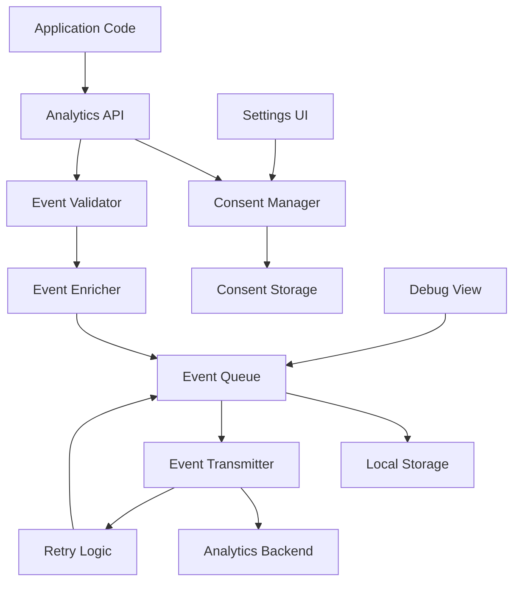

# Design Document

## Overview

The privacy-respecting analytics system provides minimal, essential event tracking for the FODMAP Fácil application while maintaining strict privacy standards. The design prioritizes user consent, data anonymization, and graceful failure handling. The system uses a modular architecture with clear separation between consent management, event collection, storage, and transmission.

### Key Design Principles

1. **Privacy by Default**: No tracking occurs without explicit user consent
2. **Minimal Data Collection**: Only essential events are tracked with minimal properties
3. **Complete Anonymization**: Zero PII collection, using random identifiers only
4. **Graceful Degradation**: Analytics failures never impact user experience
5. **Transparency**: Clear documentation and debug capabilities for user verification

## Architecture



### Component Responsibilities

- **Analytics API**: Public interface for tracking events
- **Consent Manager**: Manages user consent state and opt-out functionality
- **Event Validator**: Validates events against approved event list
- **Event Enricher**: Adds anonymous context (timestamp, session ID, user ID)
- **Event Queue**: Manages local event queue with persistence
- **Event Transmitter**: Handles network transmission with retry logic
- **Consent Storage**: Persists consent decisions using AsyncStorage
- **Local Storage**: Persists event queue using AsyncStorage

## Components and Interfaces

### 1. Analytics Service (AnalyticsService.ts)

Main service class providing the public API for event tracking.

```typescript
interface AnalyticsConfig {
  enabled: boolean;
  endpoint?: string;
  maxQueueSize?: number;
  maxEventAge?: number; // days
  debug?: boolean;
}

interface AnalyticsService {
  // Initialization
  initialize(config: AnalyticsConfig): Promise<void>;

  // Event tracking
  track(eventName: string, properties?: Record<string, any>): Promise<void>;

  // Consent management
  hasConsent(): boolean;
  requestConsent(): Promise<boolean>;
  grantConsent(): Promise<void>;
  revokeConsent(): Promise<void>;

  // Debug
  getDebugInfo(): DebugInfo;
  getRecentEvents(): AnalyticsEvent[];

  // Lifecycle
  flush(): Promise<void>;
  reset(): Promise<void>;
}
```

**Design Decisions:**

- Singleton pattern ensures single instance across app
- Async initialization allows for storage reads before tracking
- All methods are async to support storage operations
- Debug methods only available in development or when explicitly enabled

### 2. Consent Manager (ConsentManager.ts)

Manages user consent state with persistence.

```typescript
interface ConsentState {
  hasConsent: boolean;
  consentedAt: string | null;
  revokedAt: string | null;
}

interface ConsentManager {
  // State management
  getConsentState(): Promise<ConsentState>;
  setConsent(granted: boolean): Promise<void>;
  hasConsent(): Promise<boolean>;

  // Persistence
  load(): Promise<void>;
  save(): Promise<void>;
  clear(): Promise<void>;
}
```

**Design Decisions:**

- Stores both consent and revocation timestamps for audit trail
- Uses AsyncStorage for persistence across app restarts
- Separate load/save methods allow for batch operations
- Clear method supports full reset scenarios

### 3. Event Validator (EventValidator.ts)

Validates events against approved event list and sanitizes properties.

```typescript
type ApprovedEvent =
  | 'onboarding_complete'
  | 'test_started'
  | 'dose_logged'
  | 'symptom_logged'
  | 'washout_started'
  | 'report_exported'
  | 'paywall_viewed'
  | 'paywall_purchased';

interface EventValidator {
  // Validation
  isValidEvent(eventName: string): boolean;
  validateProperties(properties: Record<string, any>): Record<string, any>;

  // Sanitization
  sanitizeValue(value: any): any;
  removePII(properties: Record<string, any>): Record<string, any>;
}
```

**Design Decisions:**

- Whitelist approach with TypeScript union type for approved events
- Property sanitization removes any potential PII
- Recursive sanitization handles nested objects
- Validation happens before enrichment to fail fast

### 4. Event Enricher (EventEnricher.ts)

Adds anonymous context to events.

```typescript
interface AnalyticsEvent {
  eventName: string;
  properties: Record<string, any>;
  context: EventContext;
  timestamp: string;
}

interface EventContext {
  userId: string; // Anonymous, random UUID
  sessionId: string; // Session-specific UUID
  appVersion: string;
  platform: string; // 'ios' | 'android'
  locale: string;
}

interface EventEnricher {
  // Enrichment
  enrich(eventName: string, properties?: Record<string, any>): AnalyticsEvent;

  // Context management
  getUserId(): Promise<string>;
  getSessionId(): string;
  refreshSession(): void;
}
```

**Design Decisions:**

- User ID persists across sessions but is completely anonymous
- Session ID regenerates on each app launch
- Context includes only non-identifying technical information
- Timestamps use ISO 8601 format for consistency

### 5. Event Queue (EventQueue.ts)

Manages local event queue with persistence and size limits.

```typescript
interface QueuedEvent extends AnalyticsEvent {
  queuedAt: string;
  attempts: number;
}

interface EventQueue {
  // Queue operations
  enqueue(event: AnalyticsEvent): Promise<void>;
  dequeue(count: number): Promise<QueuedEvent[]>;
  peek(count: number): Promise<QueuedEvent[]>;

  // Queue management
  size(): Promise<number>;
  clear(): Promise<void>;
  removeOldEvents(maxAge: number): Promise<number>;

  // Persistence
  load(): Promise<void>;
  save(): Promise<void>;
}
```

**Design Decisions:**

- FIFO queue with persistence to AsyncStorage
- Maximum size limit (1000 events) prevents unbounded growth
- Automatic cleanup of events older than 7 days
- Tracks attempt count for retry logic
- Batch operations for efficiency

### 6. Event Transmitter (EventTransmitter.ts)

Handles network transmission with retry logic and exponential backoff.

```typescript
interface TransmissionResult {
  success: boolean;
  transmitted: number;
  failed: number;
  error?: Error;
}

interface EventTransmitter {
  // Transmission
  transmit(events: QueuedEvent[]): Promise<TransmissionResult>;
  transmitBatch(events: QueuedEvent[], batchSize: number): Promise<TransmissionResult>;

  // Retry logic
  shouldRetry(event: QueuedEvent, maxAttempts: number): boolean;
  getBackoffDelay(attempts: number): number;

  // Network status
  isOnline(): Promise<boolean>;
}
```

**Design Decisions:**

- Batch transmission reduces network overhead
- Exponential backoff: 1s, 2s, 4s, 8s, 16s, 32s (max)
- Maximum 6 retry attempts before discarding event
- Uses NetInfo to check connectivity before transmission
- Graceful failure with detailed error reporting

### 7. Analytics Store (analyticsStore.ts)

Zustand store for managing analytics state in the UI.

```typescript
interface AnalyticsState {
  // State
  consentGranted: boolean;
  consentPromptShown: boolean;

  // Actions
  setConsentGranted: (granted: boolean) => void;
  setConsentPromptShown: (shown: boolean) => void;
  toggleAnalytics: () => Promise<void>;
}
```

**Design Decisions:**

- Integrates with existing Zustand pattern in the app
- Persists consent prompt state to avoid repeated prompts
- Toggle action handles both service and store updates
- Reactive updates trigger UI changes automatically

## Data Models

### Event Schema

```typescript
interface AnalyticsEvent {
  eventName: ApprovedEvent;
  properties: {
    // Event-specific properties (sanitized)
    [key: string]: string | number | boolean;
  };
  context: {
    userId: string; // Anonymous UUID
    sessionId: string; // Session UUID
    appVersion: string; // e.g., "1.0.0"
    platform: 'ios' | 'android';
    locale: string; // e.g., "pt-BR"
  };
  timestamp: string; // ISO 8601
}
```

### Event Properties by Type

**onboarding_complete**

```typescript
{
  duration_seconds: number; // Time spent in onboarding
  completed_steps: number; // Number of steps completed
}
```

**test_started**

```typescript
{
  food_group: string; // e.g., "lactose", "fructose"
  test_type: string; // e.g., "standard", "custom"
}
```

**dose_logged**

```typescript
{
  food_group: string;
  dose_level: number; // 1, 2, or 3
  day_number: number;
}
```

**symptom_logged**

```typescript
{
  symptom_count: number; // Number of symptoms logged
  severity_level: 'low' | 'medium' | 'high'; // Aggregated
  has_notes: boolean; // Whether user added notes (not the notes themselves)
}
```

**washout_started**

```typescript
{
  duration_days: number;
  reason: 'scheduled' | 'symptoms' | 'manual';
}
```

**report_exported**

```typescript
{
  format: 'pdf';
  test_count: number; // Number of tests included
  date_range_days: number; // Range of data included
}
```

**paywall_viewed**

```typescript
{
  feature: string; // Feature that triggered paywall
  source_screen: string; // Screen where paywall was shown
}
```

**paywall_purchased**

```typescript
{
  plan: string; // e.g., "monthly", "annual"
  price_tier: string; // e.g., "standard", "premium"
}
```

## Error Handling

### Error Categories

1. **Consent Errors**: User has not granted consent
   - Action: Silently skip tracking, log in debug mode
   - No user-facing error

2. **Validation Errors**: Invalid event name or properties
   - Action: Log error, skip event
   - Alert developer in debug mode

3. **Storage Errors**: AsyncStorage failures
   - Action: Continue without persistence, log error
   - Retry on next operation

4. **Network Errors**: Transmission failures
   - Action: Keep in queue, retry with backoff
   - No user-facing error

5. **Queue Overflow**: Queue exceeds max size
   - Action: Drop oldest events, log warning
   - Continue accepting new events

### Error Handling Strategy

```typescript
class AnalyticsError extends Error {
  constructor(
    message: string,
    public category: 'consent' | 'validation' | 'storage' | 'network' | 'queue',
    public recoverable: boolean
  ) {
    super(message);
  }
}

// Example usage
try {
  await analyticsService.track('test_started', properties);
} catch (error) {
  if (error instanceof AnalyticsError) {
    if (error.recoverable) {
      // Queue for retry
    } else {
      // Log and discard
    }
  }
  // Never throw to application code
}
```

## Testing Strategy

### Unit Tests

1. **ConsentManager Tests**
   - Consent state persistence
   - Grant/revoke operations
   - Storage failure handling

2. **EventValidator Tests**
   - Valid event name validation
   - Invalid event rejection
   - PII sanitization
   - Property type validation

3. **EventEnricher Tests**
   - Context generation
   - User ID persistence
   - Session ID regeneration
   - Timestamp formatting

4. **EventQueue Tests**
   - FIFO ordering
   - Size limits
   - Old event cleanup
   - Persistence operations

5. **EventTransmitter Tests**
   - Batch transmission
   - Retry logic
   - Exponential backoff
   - Network status checking

### Integration Tests

1. **End-to-End Event Flow**
   - Track event → validate → enrich → queue → transmit
   - Verify event reaches backend with correct format

2. **Consent Flow**
   - No tracking without consent
   - Tracking starts after consent
   - Tracking stops after revocation
   - Queue cleared on revocation

3. **Offline Behavior**
   - Events queued when offline
   - Events transmitted when online
   - Queue persistence across app restarts

4. **Error Recovery**
   - Transmission failures trigger retry
   - Storage failures don't crash app
   - Invalid events are discarded

### Manual Testing

1. **Consent UI**
   - Consent prompt appears on first launch
   - Opt-out switch works in settings
   - Debug view shows consent status

2. **Event Tracking**
   - Events appear in debug view
   - Events have correct properties
   - No PII in event data

3. **Network Scenarios**
   - Airplane mode queues events
   - Reconnection transmits queue
   - Poor network triggers retry

## Privacy and Compliance

### Data Collection Policy

**What We Collect:**

- Anonymous user actions (approved events only)
- Technical context (app version, platform, locale)
- Timing information (timestamps)
- Anonymous identifiers (random UUIDs)

**What We DON'T Collect:**

- Names, emails, phone numbers
- Device identifiers (IMEI, MAC, advertising ID)
- Location data (GPS, IP address)
- Health data details (specific symptoms, food details)
- User-generated content (notes, comments)

### Anonymization Techniques

1. **Random Identifiers**: User ID is a random UUID with no connection to real identity
2. **Session Isolation**: Session ID changes on each app launch
3. **Aggregation**: Health data is aggregated (e.g., "high severity" vs specific symptom scores)
4. **Categorical Data**: Use categories instead of specific values where possible
5. **No Cross-Referencing**: No data that could be cross-referenced with other systems

### Compliance Considerations

- **GDPR**: Opt-in consent, right to revoke, data minimization, anonymization
- **CCPA**: Opt-out mechanism, data disclosure, no sale of data
- **HIPAA**: No PHI collection, anonymous health data only
- **App Store Guidelines**: Clear privacy policy, consent mechanism, data usage disclosure

## Performance Considerations

### Memory Management

- Event queue limited to 1000 events (~100KB)
- Batch operations reduce memory churn
- Periodic cleanup of old events
- Lazy loading of queue from storage

### Network Efficiency

- Batch transmission (up to 50 events per request)
- Compression of event payloads
- Exponential backoff reduces network spam
- Connectivity check before transmission

### Storage Efficiency

- JSON serialization for AsyncStorage
- Periodic cleanup of old events (7 days)
- Queue size limit prevents unbounded growth
- Efficient key structure for fast lookups

### CPU Efficiency

- Validation happens once before queueing
- Enrichment uses cached context
- Async operations don't block UI thread
- Debouncing for rapid event sequences

## Implementation Notes

### Dependencies

- `@react-native-async-storage/async-storage`: Consent and queue persistence
- `@react-native-community/netinfo`: Network status detection
- `expo-constants`: App version and platform info
- `expo-localization`: Locale detection
- `zustand`: State management for UI integration

### Integration Points

1. **Onboarding Flow**: Show consent prompt after disclaimer
2. **Settings Screen**: Add analytics toggle in privacy section
3. **Event Instrumentation**: Add track calls at key user actions
4. **App Initialization**: Initialize analytics service in App.tsx
5. **Debug Menu**: Add debug view in developer settings

### Configuration

```typescript
// config/analytics.ts
export const ANALYTICS_CONFIG = {
  enabled: !__DEV__, // Disabled in development by default
  endpoint: process.env.ANALYTICS_ENDPOINT || 'https://analytics.fodmapfacil.com/events',
  maxQueueSize: 1000,
  maxEventAge: 7, // days
  maxRetries: 6,
  batchSize: 50,
  debug: __DEV__,
};
```

### Environment Variables

```bash
# .env
ANALYTICS_ENDPOINT=https://analytics.fodmapfacil.com/events
ANALYTICS_ENABLED=true
```

## Future Enhancements

1. **A/B Testing**: Support for feature flags and experiments
2. **Funnel Analysis**: Track user journey through multi-step flows
3. **Crash Reporting**: Anonymous crash and error reporting
4. **Performance Monitoring**: Track app performance metrics
5. **User Feedback**: In-app feedback collection with consent
6. **Export Analytics**: Allow users to export their own analytics data
