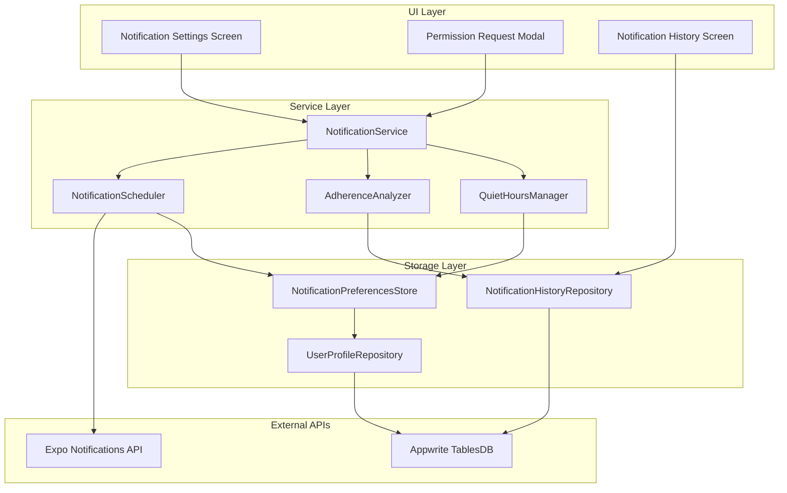
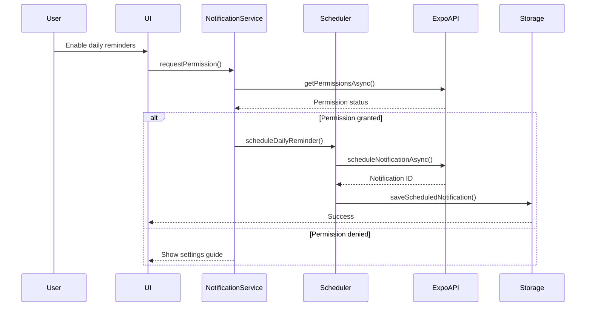

# Design Document: Personalized Notifications System

## Overview

The Personalized Notifications System provides intelligent, context-aware reminders to help users maintain adherence to their FODMAP reintroduction protocol. The system leverages Expo's notification APIs to deliver local and push notifications while respecting user preferences, quiet hours, and adherence patterns.

### Key Design Principles

1. **User-Centric**: Notifications adapt to user behavior to avoid spam
2. **Reliable**: Works offline and in background using native scheduling
3. **Flexible**: Granular control over notification types and timing
4. **Privacy-First**: All notification data stored locally with optional cloud sync
5. **Accessible**: Clear permission flows and reversible settings

### Technology Stack

- **Expo Notifications**: `expo-notifications` for local and push notifications
- **Background Tasks**: `expo-task-manager` and `expo-background-fetch` for scheduling
- **Storage**: AsyncStorage for preferences, Appwrite for cloud sync
- **State Management**: Zustand for notification preferences store
- **Date Handling**: `date-fns` for scheduling calculations

## Architecture

### High-Level Architecture



### Component Interaction Flow



## Components and Interfaces

### 1. NotificationService

Central service managing all notification operations.

```typescript
interface NotificationService {
  // Permission Management
  requestPermission(): Promise<PermissionStatus>;
  checkPermission(): Promise<PermissionStatus>;
  openSettings(): Promise<void>;

  // Scheduling
  scheduleDailyReminder(time: Date): Promise<string>;
  scheduleDoseReminder(testStep: TestStep, time: Date): Promise<string>;
  scheduleWashoutNotifications(washout: WashoutPeriod): Promise<string[]>;
  scheduleTestStartReminder(testStep: TestStep): Promise<string>;

  // Cancellation
  cancelNotification(id: string): Promise<void>;
  cancelAllNotifications(): Promise<void>;
  cancelNotificationsByType(type: NotificationType): Promise<void>;

  // History
  getNotificationHistory(days: number): Promise<NotificationHistoryEntry[]>;
  markNotificationAsActioned(id: string, action: string): Promise<void>;

  // Adaptive Behavior
  analyzeAdherence(): Promise<AdherenceMetrics>;
  adjustNotificationFrequency(metrics: AdherenceMetrics): Promise<void>;
}
```

### 2. NotificationScheduler

Handles the low-level scheduling logic and quiet hours enforcement.

```typescript
interface NotificationScheduler {
  // Core Scheduling
  schedule(notification: ScheduleNotificationInput): Promise<string>;
  reschedule(id: string, newTime: Date): Promise<void>;
  cancel(id: string): Promise<void>;

  // Quiet Hours
  isInQuietHours(time: Date): boolean;
  adjustForQuietHours(time: Date): Date;

  // Batch Operations
  scheduleMultiple(notifications: ScheduleNotificationInput[]): Promise<string[]>;
  cancelMultiple(ids: string[]): Promise<void>;

  // Query
  getScheduledNotifications(): Promise<ScheduledNotification[]>;
  getScheduledNotificationsByType(type: NotificationType): Promise<ScheduledNotification[]>;
}

interface ScheduleNotificationInput {
  title: string;
  body: string;
  data: Record<string, any>;
  trigger: NotificationTrigger;
  categoryIdentifier?: string;
  sound?: boolean;
  badge?: number;
}

interface NotificationTrigger {
  type: 'date' | 'daily' | 'weekly';
  date?: Date;
  hour?: number;
  minute?: number;
  weekday?: number;
  repeats?: boolean;
}
```

### 3. AdherenceAnalyzer

Analyzes user behavior to optimize notification frequency.

```typescript
interface AdherenceAnalyzer {
  // Analysis
  calculateAdherenceScore(userId: string, days: number): Promise<AdherenceScore>;
  detectPatterns(userId: string): Promise<AdherencePattern[]>;

  // Recommendations
  recommendNotificationFrequency(score: AdherenceScore): NotificationFrequency;
  shouldReduceReminders(userId: string): Promise<boolean>;
  shouldIncreaseReminders(userId: string): Promise<boolean>;
}

interface AdherenceScore {
  dailyLogStreak: number;
  doseTimingAccuracy: number; // 0-100
  missedReminders: number;
  totalReminders: number;
  overallScore: number; // 0-100
  period: { start: Date; end: Date };
}

interface AdherencePattern {
  type: 'consistent' | 'improving' | 'declining' | 'irregular';
  confidence: number; // 0-1
  description: string;
  recommendation: string;
}

type NotificationFrequency = 'full' | 'reduced' | 'minimal';
```

### 4. QuietHoursManager

Manages quiet hours configuration and enforcement.

```typescript
interface QuietHoursManager {
  // Configuration
  setQuietHours(start: TimeOfDay, end: TimeOfDay): Promise<void>;
  getQuietHours(): Promise<QuietHoursConfig | null>;
  disableQuietHours(): Promise<void>;

  // Validation
  isInQuietHours(time: Date): boolean;
  getNextAvailableTime(time: Date): Date;

  // Critical Notifications
  shouldOverrideQuietHours(notification: ScheduledNotification): boolean;
}

interface TimeOfDay {
  hour: number; // 0-23
  minute: number; // 0-59
}

interface QuietHoursConfig {
  enabled: boolean;
  start: TimeOfDay;
  end: TimeOfDay;
  allowCritical: boolean; // Allow dose reminders within 1 hour
}
```

### 5. NotificationPreferencesStore

Zustand store for notification preferences.

```typescript
interface NotificationPreferencesState {
  // Permission Status
  permissionStatus: PermissionStatus;
  permissionAskedAt: Date | null;

  // Enabled Types
  dailyReminderEnabled: boolean;
  doseReminderEnabled: boolean;
  washoutNotificationsEnabled: boolean;
  testStartReminderEnabled: boolean;

  // Timing
  dailyReminderTime: TimeOfDay | null;
  doseReminderAdvanceMinutes: number; // Default: 30

  // Quiet Hours
  quietHours: QuietHoursConfig | null;

  // Adaptive Behavior
  adaptiveFrequencyEnabled: boolean;
  currentFrequency: NotificationFrequency;

  // Actions
  setPermissionStatus: (status: PermissionStatus) => void;
  setDailyReminderEnabled: (enabled: boolean) => void;
  setDailyReminderTime: (time: TimeOfDay) => void;
  setQuietHours: (config: QuietHoursConfig) => void;
  setAdaptiveFrequencyEnabled: (enabled: boolean) => void;
  updateCurrentFrequency: (frequency: NotificationFrequency) => void;
  reset: () => void;
}

type PermissionStatus = 'undetermined' | 'granted' | 'denied';
```

## Data Models

### NotificationHistoryEntry

Stored in Appwrite for cloud sync and local cache.

```typescript
interface NotificationHistoryEntry {
  id: string;
  userId: string;
  notificationType: NotificationType;
  title: string;
  body: string;
  scheduledTime: Date;
  deliveredTime: Date | null;
  actionedTime: Date | null;
  action: NotificationAction | null;
  relatedEntityId: string | null; // testStepId, washoutId, etc.
  relatedEntityType: string | null; // 'test_step', 'washout', etc.
  createdAt: Date;
}

type NotificationAction =
  | 'opened'
  | 'dismissed'
  | 'dose_marked_taken'
  | 'symptom_logged'
  | 'snoozed';
```

### Extended UserProfile

Add notification preferences to existing UserProfile entity.

```typescript
interface UserProfile {
  // ... existing fields

  // Notification Preferences
  notificationPreferences: {
    permissionGranted: boolean;
    dailyReminderEnabled: boolean;
    dailyReminderTime: string | null; // ISO time string "HH:mm"
    doseReminderEnabled: boolean;
    doseReminderAdvanceMinutes: number;
    washoutNotificationsEnabled: boolean;
    testStartReminderEnabled: boolean;
    quietHoursEnabled: boolean;
    quietHoursStart: string | null; // "HH:mm"
    quietHoursEnd: string | null; // "HH:mm"
    quietHoursAllowCritical: boolean;
    adaptiveFrequencyEnabled: boolean;
    currentFrequency: NotificationFrequency;
  };
}
```

### ScheduledNotification

Local storage only (AsyncStorage), not synced to cloud.

```typescript
interface ScheduledNotification {
  id: string; // Expo notification identifier
  localId: string; // Our internal ID
  userId: string;
  notificationType: NotificationType;
  title: string;
  body: string;
  scheduledTime: Date;
  trigger: NotificationTrigger;
  data: {
    type: NotificationType;
    relatedEntityId?: string;
    relatedEntityType?: string;
    actionButtons?: NotificationActionButton[];
  };
  createdAt: Date;
}

interface NotificationActionButton {
  id: string;
  title: string;
  action: string;
}
```

## Error Handling

### Error Types

```typescript
enum NotificationErrorCode {
  PERMISSION_DENIED = 'PERMISSION_DENIED',
  PERMISSION_UNDETERMINED = 'PERMISSION_UNDETERMINED',
  SCHEDULING_FAILED = 'SCHEDULING_FAILED',
  CANCELLATION_FAILED = 'CANCELLATION_FAILED',
  INVALID_TIME = 'INVALID_TIME',
  QUIET_HOURS_CONFLICT = 'QUIET_HOURS_CONFLICT',
  STORAGE_ERROR = 'STORAGE_ERROR',
  SYNC_ERROR = 'SYNC_ERROR',
}

class NotificationError extends Error {
  constructor(
    public code: NotificationErrorCode,
    message: string,
    public details?: any
  ) {
    super(message);
    this.name = 'NotificationError';
  }
}
```

### Error Handling Strategy

1. **Permission Errors**: Show clear UI guidance to enable in settings
2. **Scheduling Errors**: Retry with exponential backoff, fallback to in-app alerts
3. **Storage Errors**: Queue operations for retry, show sync status indicator
4. **Quiet Hours Conflicts**: Automatically adjust timing, notify user of change

### Graceful Degradation

- If notifications are disabled: Show in-app dashboard alerts and badges
- If scheduling fails: Fall back to manual reminders in app
- If sync fails: Continue with local-only operation, retry on reconnect

## Testing Strategy

### Unit Tests

1. **NotificationScheduler**
   - Test quiet hours detection and adjustment
   - Test trigger calculation for daily/weekly repeats
   - Test batch scheduling and cancellation

2. **AdherenceAnalyzer**
   - Test adherence score calculation with various patterns
   - Test pattern detection algorithms
   - Test frequency recommendation logic

3. **QuietHoursManager**
   - Test time-of-day comparisons across midnight boundary
   - Test critical notification override logic
   - Test next available time calculation

### Integration Tests

1. **Permission Flow**
   - Request permission → Grant → Schedule notification
   - Request permission → Deny → Show settings guide
   - Revoke permission → Detect change → Update UI

2. **Scheduling Flow**
   - Enable daily reminder → Schedule → Verify in Expo
   - Create test step → Schedule dose reminder → Verify timing
   - Start washout → Schedule start/end notifications → Verify both

3. **Adherence Adaptation**
   - Simulate 7-day consistent logging → Verify frequency reduction
   - Simulate 2 missed logs → Verify frequency restoration
   - Simulate consistent dose timing → Verify pre-dose reminder disabled

### E2E Tests

1. **Complete User Journey**
   - Onboard → Grant permission → Enable reminders → Receive notification
   - Configure quiet hours → Schedule notification → Verify deferred delivery
   - Complete test → Receive washout notification → Start next test

2. **Background Behavior**
   - Schedule notification → Close app → Verify delivery
   - Schedule notification → Restart device → Verify delivery
   - Schedule notification → Revoke permission → Verify fallback

### Manual Testing Checklist

- [ ] Notifications appear with correct content and timing
- [ ] Action buttons work correctly (mark dose taken, snooze)
- [ ] Quiet hours prevent delivery during configured times
- [ ] Critical notifications override quiet hours
- [ ] Adaptive frequency reduces spam for engaged users
- [ ] Permission revocation is detected and handled
- [ ] Notification history displays correctly
- [ ] Settings changes take effect immediately
- [ ] Background delivery works when app is closed
- [ ] Notifications work across app updates

## Implementation Phases

### Phase 1: Core Infrastructure (Requirements 1, 7, 9)

- Set up Expo Notifications
- Implement NotificationService and NotificationScheduler
- Implement permission request flow
- Implement basic daily reminder scheduling
- Add notification preferences to UserProfile

### Phase 2: Protocol Integration (Requirements 2, 3, 4)

- Implement dose reminder scheduling
- Implement washout notification scheduling
- Implement test start reminder scheduling
- Integrate with existing protocol state management

### Phase 3: Quiet Hours & Preferences (Requirements 5, 8)

- Implement QuietHoursManager
- Build notification settings screen
- Implement per-type notification toggles
- Add quiet hours configuration UI

### Phase 4: Adaptive Behavior (Requirement 6)

- Implement AdherenceAnalyzer
- Implement pattern detection algorithms
- Implement automatic frequency adjustment
- Add adherence metrics to user profile

### Phase 5: History & Polish (Requirement 10)

- Implement notification history storage
- Build notification history screen
- Add action tracking
- Implement history filtering and search

### Phase 6: Testing & Optimization

- Write comprehensive test suite
- Perform E2E testing
- Optimize battery usage
- Performance profiling

## Security Considerations

1. **Data Privacy**
   - Notification content stored locally by default
   - Cloud sync is optional and encrypted
   - No sensitive health data in notification body (use generic text)

2. **Permission Handling**
   - Never assume permission is granted
   - Always check permission before scheduling
   - Handle permission revocation gracefully

3. **Rate Limiting**
   - Maximum 10 notifications per day per user
   - Minimum 1 hour between notifications of same type
   - Adaptive frequency prevents spam

## Performance Considerations

1. **Battery Optimization**
   - Use native scheduling APIs (no background polling)
   - Batch notification scheduling operations
   - Minimize wake-ups by consolidating notifications

2. **Storage Optimization**
   - Limit notification history to 30 days
   - Compress notification data in AsyncStorage
   - Lazy-load history on demand

3. **Scheduling Efficiency**
   - Pre-calculate notification times for entire protocol
   - Update schedules only when protocol state changes
   - Use efficient date calculations with date-fns

## Accessibility

1. **Screen Reader Support**
   - All notification settings have proper labels
   - Notification content is screen-reader friendly
   - Action buttons have descriptive labels

2. **Visual Accessibility**
   - High contrast for notification settings
   - Large touch targets for toggles
   - Clear visual feedback for state changes

3. **Cognitive Accessibility**
   - Simple, clear notification text
   - Consistent notification patterns
   - Progressive disclosure in settings

## Internationalization

1. **Notification Content**
   - All notification text uses i18n keys
   - Support for pt-BR and en-US
   - Time formatting respects locale

2. **Time Display**
   - 12/24 hour format based on device settings
   - Date formatting respects locale
   - Timezone handling for scheduling

## Monitoring & Analytics

1. **Key Metrics**
   - Notification delivery rate
   - Notification action rate (opened, dismissed, actioned)
   - Permission grant/deny rate
   - Adherence score distribution
   - Quiet hours usage

2. **Error Tracking**
   - Permission errors
   - Scheduling failures
   - Sync errors
   - Background delivery failures

3. **User Behavior**
   - Most effective notification types
   - Optimal reminder times
   - Quiet hours patterns
   - Adaptive frequency effectiveness
