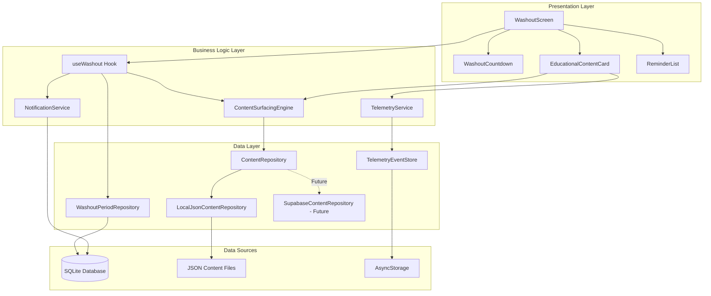
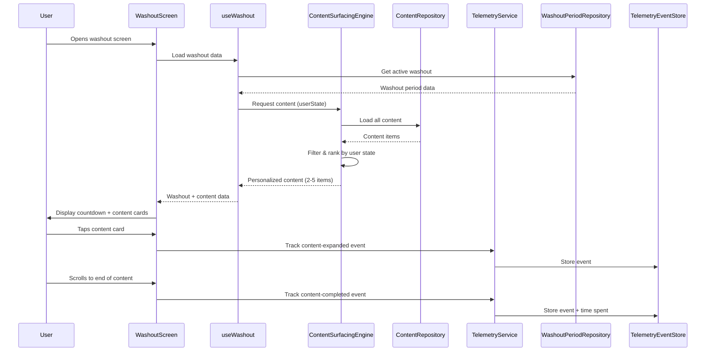

# Design Document

## Overview

The Washout Guided Educational Content feature provides users with a supportive, informative experience during washout periods in the FODMAP reintroduction protocol. The system combines real-time countdown tracking, contextual reminders, and dynamically surfaced educational content to keep users engaged and informed during waiting periods.

The architecture follows the existing app patterns with React Native screens, TypeScript-based repositories, and a JSON-based content management system that can be migrated to Supabase. The design emphasizes user state-driven content personalization, telemetry tracking for analytics, and offline-first functionality.

## Architecture

### High-Level Architecture



### Component Interaction Flow



## Components and Interfaces

### 1. Presentation Components

#### WashoutScreen

Main screen component for the washout period experience.

**Location:** `src/features/washout/screens/WashoutScreen.tsx`

**Props:**

```typescript
interface WashoutScreenProps {
  washoutPeriodId: string;
}
```

**Responsibilities:**

- Display countdown timer
- Render educational content cards
- Show reminder messages
- Handle navigation to content detail view
- Track user interactions for telemetry

#### WashoutCountdown

Countdown timer component showing time remaining.

**Location:** `src/features/washout/components/WashoutCountdown.tsx`

**Props:**

```typescript
interface WashoutCountdownProps {
  startDate: Date;
  endDate: Date;
  status: WashoutPeriodStatus;
  onComplete?: () => void;
}
```

**Features:**

- Real-time countdown (days, hours)
- Progress bar visualization
- Completion notification
- Accessibility support

#### EducationalContentCard

Card component for displaying educational content.

**Location:** `src/features/washout/components/EducationalContentCard.tsx`

**Props:**

```typescript
interface EducationalContentCardProps {
  content: EducationalContent;
  onExpand: (contentId: string) => void;
  onView: (contentId: string) => void;
  onComplete: (contentId: string, timeSpent: number) => void;
}
```

**Features:**

- Collapsible/expandable content
- Category badges (social tips, recipes, guidance)
- Difficulty level indicators
- Read time estimation
- Scroll tracking for completion

#### ReminderBanner

Banner component for displaying contextual reminders.

**Location:** `src/features/washout/components/ReminderBanner.tsx`

**Props:**

```typescript
interface ReminderBannerProps {
  message: string;
  type: 'info' | 'warning' | 'success';
  dismissible?: boolean;
  onDismiss?: () => void;
}
```

### 2. Business Logic Layer

#### useWashout Hook

Custom React hook for washout period management.

**Location:** `src/features/washout/hooks/useWashout.ts`

**Interface:**

```typescript
interface UseWashoutReturn {
  washoutPeriod: WashoutPeriod | null;
  countdown: {
    days: number;
    hours: number;
    minutes: number;
    isComplete: boolean;
  };
  educationalContent: EducationalContent[];
  reminders: ReminderMessage[];
  isLoading: boolean;
  error: Error | null;
  refreshContent: () => Promise<void>;
  updateReminderFrequency: (hours: number) => Promise<void>;
}

function useWashout(washoutPeriodId: string): UseWashoutReturn;
```

**Responsibilities:**

- Fetch washout period data
- Calculate countdown values
- Request personalized content from ContentSurfacingEngine
- Manage reminder state
- Handle real-time updates

#### ContentSurfacingEngine

Service for selecting and ranking educational content based on user state.

**Location:** `src/features/washout/services/ContentSurfacingEngine.ts`

**Interface:**

```typescript
interface UserState {
  experienceLevel: 'novice' | 'intermediate' | 'advanced';
  anxietyLevel: 'low' | 'medium' | 'high';
  protocolPhase: ProtocolPhase;
  completedTestsCount: number;
  previouslyViewedContentIds: string[];
}

interface ContentSurfacingEngine {
  selectContent(userState: UserState, count?: number): Promise<EducationalContent[]>;

  rankContent(content: EducationalContent[], userState: UserState): EducationalContent[];
}
```

**Algorithm:**

1. Load all available content from ContentRepository
2. Filter content based on user state:
   - Experience level matching
   - Anxiety level appropriateness
   - Exclude previously viewed content (if sufficient new content exists)
3. Rank content by relevance score:
   - Exact match on experience level: +10 points
   - Anxiety-support tag when anxiety is high: +15 points
   - Content not viewed before: +5 points
   - Recency of content creation: +0-3 points
4. Return top N items (default 2-5)

#### TelemetryService

Service for tracking content interaction events.

**Location:** `src/features/washout/services/TelemetryService.ts`

**Interface:**

```typescript
interface TelemetryEvent {
  eventType: 'content-viewed' | 'content-expanded' | 'content-completed';
  contentId: string;
  timestamp: Date;
  userState: UserState;
  metadata?: {
    timeSpent?: number;
    scrollDepth?: number;
  };
}

interface TelemetryService {
  trackContentViewed(contentId: string, userState: UserState): Promise<void>;
  trackContentExpanded(contentId: string, userState: UserState): Promise<void>;
  trackContentCompleted(contentId: string, userState: UserState, timeSpent: number): Promise<void>;
  syncEvents(): Promise<void>;
}
```

**Features:**

- Event batching (max 50 events or 5 minutes)
- Local persistence before sync
- Retry logic for failed syncs
- User state context in all events

#### NotificationService

Service for scheduling and managing washout reminders.

**Location:** `src/features/washout/services/NotificationService.ts`

**Interface:**

```typescript
interface NotificationService {
  scheduleWashoutReminders(
    washoutPeriod: WashoutPeriod,
    frequencyHours: number,
    anxietyLevel: 'low' | 'medium' | 'high'
  ): Promise<void>;

  cancelWashoutReminders(washoutPeriodId: string): Promise<void>;

  updateReminderFrequency(washoutPeriodId: string, frequencyHours: number): Promise<void>;
}
```

**Reminder Frequency Logic:**

- Base frequency: User-configured (1-24 hours)
- High anxiety multiplier: 0.67x (increases frequency by 50%)
- Example: 6-hour base → 4-hour frequency for high anxiety

### 3. Data Layer

#### WashoutPeriodRepository

Repository for washout period data access.

**Location:** `src/services/repositories/WashoutPeriodRepository.ts`

**Interface:**

```typescript
interface WashoutPeriodRepository {
  findById(id: string): Promise<WashoutPeriod | null>;
  findActive(protocolRunId: string): Promise<WashoutPeriod | null>;
  findByProtocolRun(protocolRunId: string): Promise<WashoutPeriod[]>;
  create(data: CreateWashoutPeriodInput): Promise<WashoutPeriod>;
  update(id: string, data: UpdateWashoutPeriodInput): Promise<WashoutPeriod>;
  delete(id: string): Promise<void>;
}
```

**Note:** Extends existing `BaseRepository` pattern.

#### ContentRepository (Interface)

Abstract repository interface for content storage.

**Location:** `src/features/washout/repositories/ContentRepository.ts`

**Interface:**

```typescript
interface ContentRepository {
  loadAll(): Promise<EducationalContent[]>;
  findById(id: string): Promise<EducationalContent | null>;
  findByCategory(category: ContentCategory): Promise<EducationalContent[]>;
  findByTags(tags: string[]): Promise<EducationalContent[]>;
}
```

#### LocalJsonContentRepository

JSON file-based implementation of ContentRepository.

**Location:** `src/features/washout/repositories/LocalJsonContentRepository.ts`

**Implementation Details:**

- Loads content from `src/content/education/*.json`
- Validates against TypeScript schema on load
- Caches content in memory
- Logs validation errors for invalid items
- Skips invalid items gracefully

**Migration Path:**

```typescript
// Current: Local JSON
const contentRepo: ContentRepository = new LocalJsonContentRepository();

// Future: Supabase
const contentRepo: ContentRepository = new SupabaseContentRepository(supabaseClient);
```

#### TelemetryEventStore

Local storage for telemetry events before sync.

**Location:** `src/features/washout/stores/TelemetryEventStore.ts`

**Interface:**

```typescript
interface TelemetryEventStore {
  addEvent(event: TelemetryEvent): Promise<void>;
  getUnsynced(): Promise<TelemetryEvent[]>;
  markSynced(eventIds: string[]): Promise<void>;
  clear(): Promise<void>;
}
```

**Implementation:** Uses AsyncStorage with JSON serialization.

## Data Models

### EducationalContent Type

**Location:** `src/content/education/types.ts`

```typescript
type ContentCategory = 'social-tips' | 'recipes' | 'fodmap-guidance' | 'anxiety-support';
type DifficultyLevel = 'beginner' | 'intermediate' | 'advanced';
type AnxietyLevel = 'low' | 'medium' | 'high';

interface EducationalContent {
  id: string;
  title: string;
  summary: string;
  content: string; // Markdown format
  category: ContentCategory;
  tags: string[];
  difficultyLevel: DifficultyLevel;
  targetAnxietyLevels: AnxietyLevel[];
  potentiallyStressful: boolean;
  estimatedReadTimeMinutes: number;
  createdAt: string; // ISO 8601
  updatedAt: string; // ISO 8601
  author?: string;
  imageUrl?: string;
}
```

### JSON Content Schema

**Location:** `src/content/education/schema.json`

```json
{
  "$schema": "http://json-schema.org/draft-07/schema#",
  "type": "object",
  "required": [
    "id",
    "title",
    "summary",
    "content",
    "category",
    "tags",
    "difficultyLevel",
    "targetAnxietyLevels",
    "potentiallyStressful",
    "estimatedReadTimeMinutes",
    "createdAt",
    "updatedAt"
  ],
  "properties": {
    "id": { "type": "string" },
    "title": { "type": "string", "maxLength": 100 },
    "summary": { "type": "string", "maxLength": 200 },
    "content": { "type": "string" },
    "category": {
      "type": "string",
      "enum": ["social-tips", "recipes", "fodmap-guidance", "anxiety-support"]
    },
    "tags": {
      "type": "array",
      "items": { "type": "string" }
    },
    "difficultyLevel": {
      "type": "string",
      "enum": ["beginner", "intermediate", "advanced"]
    },
    "targetAnxietyLevels": {
      "type": "array",
      "items": {
        "type": "string",
        "enum": ["low", "medium", "high"]
      }
    },
    "potentiallyStressful": { "type": "boolean" },
    "estimatedReadTimeMinutes": { "type": "integer", "minimum": 1 },
    "createdAt": { "type": "string", "format": "date-time" },
    "updatedAt": { "type": "string", "format": "date-time" },
    "author": { "type": "string" },
    "imageUrl": { "type": "string", "format": "uri" }
  }
}
```

### Example Content File

**Location:** `src/content/education/social-tips-001.json`

```json
{
  "id": "social-tips-001",
  "title": "Dining Out During FODMAP Testing",
  "summary": "Practical tips for maintaining your protocol when eating at restaurants with friends and family.",
  "content": "# Dining Out During FODMAP Testing\n\n## Planning Ahead\n\nCall the restaurant in advance and ask about ingredient lists...\n\n## Communication Strategies\n\nBe clear and confident when explaining your dietary needs...",
  "category": "social-tips",
  "tags": ["dining-out", "social-situations", "restaurants"],
  "difficultyLevel": "beginner",
  "targetAnxietyLevels": ["medium", "high"],
  "potentiallyStressful": false,
  "estimatedReadTimeMinutes": 5,
  "createdAt": "2025-01-15T10:00:00Z",
  "updatedAt": "2025-01-15T10:00:00Z",
  "author": "FODMAP Nutrition Team"
}
```

### UserState Derivation

User state is derived from multiple data sources:

```typescript
async function deriveUserState(userId: string): Promise<UserState> {
  const userProfile = await userProfileRepository.findById(userId);
  const activeProtocolRun = await protocolRunRepository.findActive(userId);
  const completedTests = await testStepRepository.findCompleted(activeProtocolRun.id);
  const viewedContent = await telemetryEventStore.getViewedContentIds(userId);

  // Experience level based on completed tests
  let experienceLevel: 'novice' | 'intermediate' | 'advanced';
  if (completedTests.length === 0) {
    experienceLevel = 'novice';
  } else if (completedTests.length < 5) {
    experienceLevel = 'intermediate';
  } else {
    experienceLevel = 'advanced';
  }

  // Anxiety level from user profile or assessment
  const anxietyLevel = userProfile.anxietyLevel || 'medium';

  return {
    experienceLevel,
    anxietyLevel,
    protocolPhase: activeProtocolRun.phase,
    completedTestsCount: completedTests.length,
    previouslyViewedContentIds: viewedContent,
  };
}
```

## Error Handling

### Content Loading Errors

**Strategy:** Graceful degradation with fallback content

```typescript
try {
  const content = await contentRepository.loadAll();
  return content;
} catch (error) {
  console.error('Failed to load educational content:', error);

  // Return minimal fallback content
  return [
    {
      id: 'fallback-001',
      title: 'About Washout Periods',
      summary: 'Learn why washout periods are important in FODMAP testing.',
      content: 'Washout periods allow your digestive system to reset...',
      category: 'fodmap-guidance',
      tags: ['basics'],
      difficultyLevel: 'beginner',
      targetAnxietyLevels: ['low', 'medium', 'high'],
      potentiallyStressful: false,
      estimatedReadTimeMinutes: 3,
      createdAt: new Date().toISOString(),
      updatedAt: new Date().toISOString(),
    },
  ];
}
```

### Telemetry Sync Errors

**Strategy:** Retry with exponential backoff, persist locally

```typescript
async function syncEvents(maxRetries = 3): Promise<void> {
  const events = await telemetryEventStore.getUnsynced();

  for (let attempt = 0; attempt < maxRetries; attempt++) {
    try {
      await analyticsBackend.sendEvents(events);
      await telemetryEventStore.markSynced(events.map((e) => e.id));
      return;
    } catch (error) {
      if (attempt === maxRetries - 1) {
        console.error('Failed to sync telemetry after max retries:', error);
        // Events remain in local store for next sync attempt
        return;
      }

      // Exponential backoff: 1s, 2s, 4s
      await new Promise((resolve) => setTimeout(resolve, 1000 * Math.pow(2, attempt)));
    }
  }
}
```

### Countdown Timer Edge Cases

**Scenarios:**

1. **Washout period already complete:** Display completion message, hide countdown
2. **System time change:** Recalculate countdown on app resume
3. **Negative time remaining:** Clamp to zero, trigger completion

```typescript
function calculateCountdown(startDate: Date, endDate: Date): Countdown {
  const now = new Date();
  const remaining = endDate.getTime() - now.getTime();

  if (remaining <= 0) {
    return { days: 0, hours: 0, minutes: 0, isComplete: true };
  }

  const days = Math.floor(remaining / (1000 * 60 * 60 * 24));
  const hours = Math.floor((remaining % (1000 * 60 * 60 * 24)) / (1000 * 60 * 60));
  const minutes = Math.floor((remaining % (1000 * 60 * 60)) / (1000 * 60));

  return { days, hours, minutes, isComplete: false };
}
```

## Testing Strategy

### Unit Tests

**Content Surfacing Engine Tests**

- Test content filtering by experience level
- Test content ranking algorithm
- Test anxiety-based content selection
- Test exclusion of previously viewed content
- Test fallback when insufficient content available

**Telemetry Service Tests**

- Test event batching logic
- Test local persistence
- Test sync retry mechanism
- Test event deduplication

**Countdown Calculation Tests**

- Test countdown accuracy
- Test edge cases (negative time, zero time)
- Test timezone handling

### Integration Tests

**Washout Screen Flow**

- Test screen loads with active washout period
- Test content cards render correctly
- Test countdown updates in real-time
- Test telemetry events fire on interactions
- Test reminder banner displays

**Content Repository Tests**

- Test JSON file loading
- Test schema validation
- Test invalid content handling
- Test caching behavior

### Component Tests

**EducationalContentCard**

- Test expand/collapse functionality
- Test scroll tracking for completion
- Test accessibility labels
- Test telemetry event triggers

**WashoutCountdown**

- Test countdown display formatting
- Test progress bar calculation
- Test completion callback

## Performance Considerations

### Content Loading Optimization

**Strategy:** Lazy load content details, cache in memory

```typescript
class LocalJsonContentRepository implements ContentRepository {
  private contentCache: Map<string, EducationalContent> = new Map();
  private summariesCache: EducationalContentSummary[] | null = null;

  async loadAll(): Promise<EducationalContent[]> {
    // First load: Load only summaries for fast initial render
    if (!this.summariesCache) {
      this.summariesCache = await this.loadSummaries();
    }

    // Full content loaded on demand
    return this.summariesCache.map((summary) => this.contentCache.get(summary.id) || summary);
  }

  async findById(id: string): Promise<EducationalContent | null> {
    if (this.contentCache.has(id)) {
      return this.contentCache.get(id)!;
    }

    const content = await this.loadContentFile(id);
    this.contentCache.set(id, content);
    return content;
  }
}
```

### Countdown Timer Optimization

**Strategy:** Update only when visible, use efficient intervals

```typescript
useEffect(() => {
  if (!isScreenFocused) return;

  // Update every minute instead of every second
  const interval = setInterval(() => {
    setCountdown(calculateCountdown(startDate, endDate));
  }, 60000);

  return () => clearInterval(interval);
}, [startDate, endDate, isScreenFocused]);
```

### Telemetry Batching

**Strategy:** Batch events to reduce storage writes

```typescript
class TelemetryService {
  private eventBuffer: TelemetryEvent[] = [];
  private flushTimer: NodeJS.Timeout | null = null;

  async trackEvent(event: TelemetryEvent): Promise<void> {
    this.eventBuffer.push(event);

    // Flush if buffer reaches 50 events
    if (this.eventBuffer.length >= 50) {
      await this.flush();
      return;
    }

    // Schedule flush after 5 minutes
    if (!this.flushTimer) {
      this.flushTimer = setTimeout(() => this.flush(), 5 * 60 * 1000);
    }
  }

  private async flush(): Promise<void> {
    if (this.eventBuffer.length === 0) return;

    const events = [...this.eventBuffer];
    this.eventBuffer = [];

    if (this.flushTimer) {
      clearTimeout(this.flushTimer);
      this.flushTimer = null;
    }

    await this.telemetryEventStore.addEvents(events);
  }
}
```

## Accessibility

### Screen Reader Support

- All countdown values have descriptive labels
- Content cards announce category and difficulty
- Reminder banners use `accessibilityRole="alert"`
- Expand/collapse state announced

### Font Scaling

- All text components support `allowFontScaling={true}`
- Maximum font size multiplier: 2.0
- Layout adapts to larger text sizes

### Color Contrast

- All text meets WCAG AA standards (4.5:1 minimum)
- Category badges use high-contrast colors
- Countdown timer uses theme-aware colors

### Keyboard Navigation

- All interactive elements have minimum 44x44 touch target
- Focus order follows logical reading order
- Dismiss actions clearly labeled

## Migration Path to Supabase

### Phase 1: Current Implementation (Local JSON)

```typescript
// src/features/washout/repositories/ContentRepository.ts
export interface ContentRepository {
  loadAll(): Promise<EducationalContent[]>;
  findById(id: string): Promise<EducationalContent | null>;
  findByCategory(category: ContentCategory): Promise<EducationalContent[]>;
  findByTags(tags: string[]): Promise<EducationalContent[]>;
}

// src/features/washout/repositories/LocalJsonContentRepository.ts
export class LocalJsonContentRepository implements ContentRepository {
  // Implementation using JSON files
}

// Dependency injection in app initialization
const contentRepository: ContentRepository = new LocalJsonContentRepository();
```

### Phase 2: Supabase Migration

**Database Schema:**

```sql
CREATE TABLE educational_content (
  id TEXT PRIMARY KEY,
  title TEXT NOT NULL,
  summary TEXT NOT NULL,
  content TEXT NOT NULL,
  category TEXT NOT NULL,
  tags TEXT[] NOT NULL,
  difficulty_level TEXT NOT NULL,
  target_anxiety_levels TEXT[] NOT NULL,
  potentially_stressful BOOLEAN NOT NULL,
  estimated_read_time_minutes INTEGER NOT NULL,
  created_at TIMESTAMP WITH TIME ZONE NOT NULL,
  updated_at TIMESTAMP WITH TIME ZONE NOT NULL,
  author TEXT,
  image_url TEXT
);

CREATE INDEX idx_educational_content_category ON educational_content(category);
CREATE INDEX idx_educational_content_difficulty ON educational_content(difficulty_level);
CREATE INDEX idx_educational_content_tags ON educational_content USING GIN(tags);
```

**Supabase Repository Implementation:**

```typescript
// src/features/washout/repositories/SupabaseContentRepository.ts
export class SupabaseContentRepository implements ContentRepository {
  constructor(private supabase: SupabaseClient) {}

  async loadAll(): Promise<EducationalContent[]> {
    const { data, error } = await this.supabase
      .from('educational_content')
      .select('*')
      .order('created_at', { ascending: false });

    if (error) throw error;
    return data.map(this.mapToEducationalContent);
  }

  async findById(id: string): Promise<EducationalContent | null> {
    const { data, error } = await this.supabase
      .from('educational_content')
      .select('*')
      .eq('id', id)
      .single();

    if (error) return null;
    return this.mapToEducationalContent(data);
  }

  // ... other methods
}

// Switch implementation via environment variable or feature flag
const contentRepository: ContentRepository =
  process.env.USE_SUPABASE_CONTENT === 'true'
    ? new SupabaseContentRepository(supabaseClient)
    : new LocalJsonContentRepository();
```

**Migration Script:**

```typescript
// scripts/migrate-content-to-supabase.ts
async function migrateContentToSupabase() {
  const localRepo = new LocalJsonContentRepository();
  const supabaseRepo = new SupabaseContentRepository(supabaseClient);

  const localContent = await localRepo.loadAll();

  for (const content of localContent) {
    await supabaseRepo.create(content);
    console.log(`Migrated: ${content.id}`);
  }

  console.log(`Migration complete: ${localContent.length} items`);
}
```

## Future Enhancements

### Content Recommendations

- Machine learning-based content recommendations
- Collaborative filtering based on similar users
- A/B testing for content effectiveness

### Interactive Content

- Embedded videos and animations
- Interactive recipe calculators
- Quizzes and knowledge checks

### Social Features

- User-generated content submissions
- Content ratings and reviews
- Community discussion threads

### Advanced Analytics

- Content engagement heatmaps
- Drop-off point analysis
- Conversion tracking (content → behavior change)
